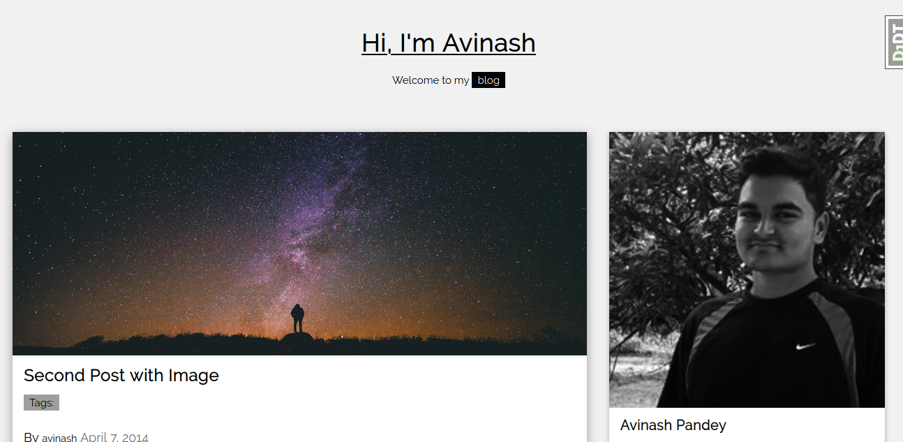

# django-blog  

A simple blog built with Django.

### Features include:  
> List and Detail view
> Comment system
> Share via e-mail

## Setup Instructions  

> git clone https://github.com/Batman-Avinash/django-blog.git
> cd django-blog

### Setup your virtual environment
> python3 -m venv env
> source env/bin/activate

### Install dependencies
> pip install -r requirements.txt
> python manage.py migrate
> python mange.py runserver

